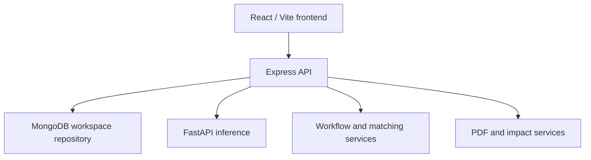

# Architecture

## Organization

- `frontend/src/App.tsx`: role-protected routes and working screens.
- `frontend/src/components.tsx`: shared Radix dialogs/selects, forms, tables, badges.
- `frontend/src/api.ts`: centralized authenticated requests/downloads.
- `backend/src/routes/api.ts`: REST boundary and Zod request validation.
- `backend/src/middleware/auth.ts`: verified JWT subject → server-loaded active user/organization.
- `backend/src/services/domain.ts`: suitability, matching, state transitions, ownership, notifications, audit and canonical analytics.
- `backend/src/services/csv.ts`: bounded CSV parsing and duplicate detection.
- `backend/src/repositories/store.ts`: Mongo revision compare-and-swap or local queued atomic writes.
- `backend/src/services/seedData.ts`: deterministic synthetic records relative to initialization date.
- `ai-service/main.py`: chronological forecasting and actual CPU ONNX inference.

## Persistence and concurrency

One bounded, versioned workspace document stores all domain arrays. Each API mutation operates on a snapshot, then atomically replaces the payload if the revision still matches. A competing update reloads/retries the pure mutation. A second acceptance or partner claim sees the already changed state and fails. External effects do not run inside these retries.

Local mode serializes changes and writes a temporary file before rename. It supports one API process only. The Mongo workspace limit is 12 MB, below the BSON limit, and POS history is capped at 15,000 records. This is a prototype tradeoff, not a recommended large-scale collection/index design.

Production expansion should split users, organizations, POS, inventory, forecasts, surplus, redistribution, recovery, notifications and audit into indexed collections, using transactions or conditional updates for shared allocations. Current API contracts and services separate this future migration from UI behavior.

## Security and integrity

JWTs contain a user subject. Role/organization is reloaded from the server store on every protected request; frontend role strings never authorize an operation. Password hashes never leave login/me endpoints. Organization deactivation invalidates active sessions. No secret belongs in the frontend bundle.

Inputs are parsed with bounded schemas. Images have byte and decoded-pixel limits. Inference requires a private server token. Requests use CORS allowlists, Helmet and basic rate limiting. OTP codes are random and role-scoped; state transitions prevent replay after completion. Production hardening still needs per-record code-attempt lockout, refresh-token rotation, password recovery, monitoring, secure object storage and tenant-scaled schemas.

## Inference and reporting

Forecasting is server-to-server and fails independently of operational workflows. Image inference is a general classifier, not a freshness detector. A required human review gate follows any uploaded visual assessment. Reporting differentiates prevention, redistribution, recovery and disposal; a confirmed delivery is not counted until recipient receipt confirmation.

All times are UTC in persisted timestamps. Recipient opening/closing hours are explicitly UTC; a future pilot should support organization time zones and daylight-saving rules.
